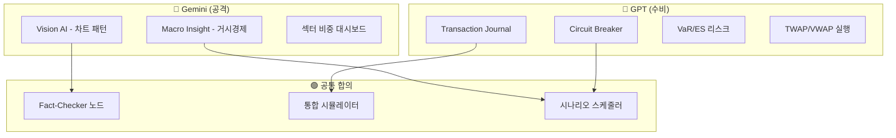
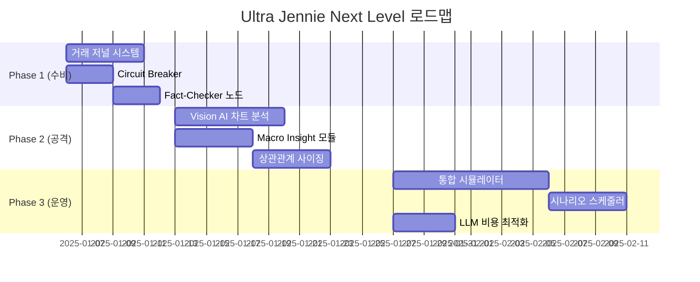

# Ultra Jennie Next Level 발전 로드맵

> Gemini(공격적 수익 극대화)와 GPT(방어적 안정성 강화)의 제안을 현재 `my-ultra-jennie` 프로젝트 상태에 맞게 종합한 실행 계획입니다.
> 
> **작성일**: 2025-12-12  
> **버전**: v1.0

---

## 📊 현재 시스템 분석

### 강점 (이미 구축된 것들)
| 영역 | 구현체 | 상태 |
|------|--------|------|
| LLM 오케스트레이션 | `JennieBrain` (QuantScorer → Hunter → Debate → Judge) | ✅ 완료 |
| 포지션 사이징 | `PositionSizer` (ATR 기반 Risk-Parity) | ✅ 완료 |
| 시장 국면 분석 | `MarketRegimeDetector` (STRONG_BULL/BULL/SIDEWAYS/BEAR) | ✅ 완료 |
| 백테스트 | `backtest.py` (2,593줄, 멀티프로세스 지원) | ✅ 완료 |
| 캐시/상태 관리 | Redis (sentiment, regime, competitor benefit 등) | ✅ 완료 |
| 실행 자동화 | buy-scanner, buy/sell-executor, price-monitor | ✅ 완료 |

### 개선 필요 영역
| 영역 | 현재 상태 | 필요 개선 |
|------|-----------|-----------|
| 거래 저널 | 로그 파일 의존 | Event Sourcing + DB 저장 |
| 장애 방어 | 기본 재시도 | Circuit Breaker 패턴 |
| 차트 분석 | 지표 기반만 | Vision AI (캔들 패턴) |
| 사실 검증 | 없음 | Fact-Checker 노드 |
| 상관관계 | 섹터 분산만 | 상관관계 기반 사이징 |

---

## 🎯 Gemini vs GPT 제안 비교

---

## 🚀 최종 통합 로드맵

### Phase 1: 수비 강화 (1-2주) 🛡️
> **목표**: 시스템 안정성 확보, 장애 시 자동 복구

#### 1.1 거래 저널 시스템 (Transaction Journal)
- **구현 위치**: `shared/transaction_journal.py` [NEW]
- **핵심 기능**: 
  - 모든 주문 상태를 Event로 기록 (ORDER_PLACED → FILLED → CLOSED)
  - Redis에 실시간 미러링 + MariaDB에 영구 저장
  - 시스템 재시작 시 포지션 자동 복구
- **영향 서비스**: `buy-executor`, `sell-executor`, `command-handler`
- **난이도**: ⭐⭐⭐ (중간)
- **ROI**: 🔥🔥🔥🔥 (장애 시 손실 방지)

#### 1.2 Circuit Breaker 패턴
- **구현 위치**: `shared/kis/circuit_breaker.py` [NEW]
- **핵심 기능**:
  - KIS API 연속 실패 시 자동 차단 (threshold: 5회)
  - 점진적 재시도 (Exponential Backoff)
  - Grafana 대시보드에 상태 표시
- **적용 대상**: `shared/kis/client.py`, `shared/kis/gateway_client.py`
- **난이도**: ⭐⭐ (낮음)
- **ROI**: 🔥🔥🔥 (계좌 잠금 방지)

#### 1.3 Fact-Checker 노드
- **구현 위치**: `shared/llm.py` 내 `JennieBrain.run_fact_check()` [NEW METHOD]
- **핵심 기능**:
  - Judge 단계 전에 뉴스 원문과 LLM 분석 내용 비교
  - 환각(Hallucination) 탐지 시 경고 플래그 설정
  - 캐시된 뉴스 데이터와 교차 검증
- **난이도**: ⭐⭐ (낮음)
- **ROI**: 🔥🔥🔥🔥🔥 (잘못된 매매 결정 방지)

---

### Phase 2: 공격 강화 (2-3주) 👁️
> **목표**: 수익률 향상을 위한 분석 고도화

#### 2.1 Vision AI - 차트 패턴 분석
- **구현 위치**: `shared/vision_analyzer.py` [NEW]
- **핵심 기능**:
  - 캔들 차트 이미지 생성 (matplotlib/mplfinance)
  - Gemini Vision API로 패턴 분석 (W패턴, 헤드앤숄더 등)
  - Hunter 스코어에 기술적 분석 점수 추가
- **통합 대상**: `scout_pipeline.py`의 `process_quant_scoring_task()`
- **난이도**: ⭐⭐⭐ (중간)
- **ROI**: 🔥🔥🔥🔥 (기술적 분석 자동화)

#### 2.2 Macro Insight 모듈
- **구현 위치**: `shared/macro_insight.py` [NEW]
- **핵심 기능**:
  - 장 시작 전 거시경제 브리핑 자동 생성
  - 금리, 환율, 국제 시장 동향 분석
  - `MarketRegimeDetector`와 연동하여 동적 임계값 조정
- **스케줄**: `daily-briefing` 서비스와 통합
- **난이도**: ⭐⭐⭐ (중간)
- **ROI**: 🔥🔥🔥 (시장 상황 적응력)

#### 2.3 상관관계 기반 포지션 사이징
- **구현 위치**: `shared/position_sizing.py` 확장 [MODIFY]
- **핵심 기능**:
  - 포트폴리오 내 종목 간 상관계수 계산
  - 상관관계가 높은 종목군은 전체 비중 제한
  - Risk Parity에 상관관계 가중치 추가
- **난이도**: ⭐⭐⭐ (중간)
- **ROI**: 🔥🔥🔥🔥 (집중 리스크 방지)

---

### Phase 3: 운영 고도화 (3-4주) 📊
> **목표**: 전략 검증 자동화 및 이벤트 대응

#### 3.1 통합 시뮬레이터 (Production-Mirror)
- **구현 위치**: `utilities/simulator.py` [NEW]
- **핵심 기능**:
  - 기존 `backtest.py` 로직을 RabbitMQ 기반으로 재구성
  - 실제 서비스 플로우와 동일한 메시지 흐름
  - 전략 변경 시 회귀 테스트 자동화
- **난이도**: ⭐⭐⭐⭐ (높음)
- **ROI**: 🔥🔥🔥🔥🔥 (전략 검증 필수)

#### 3.2 시나리오 스케줄러
- **구현 위치**: `services/scheduler-service/scenario_scheduler.py` [NEW]
- **핵심 기능**:
  - 경제 지표 발표 일정 자동 수집 (금통위, FOMC 등)
  - 이벤트 전후 자동 리스크 조정 규칙
  - Macro Insight 모듈과 연동
- **난이도**: ⭐⭐⭐ (중간)
- **ROI**: 🔥🔥🔥 (이벤트 리스크 관리)

#### 3.3 LLM 비용 최적화
- **구현 위치**: `shared/llm_cache.py` [NEW]
- **핵심 기능**:
  - Debate/Judge 결과 ChromaDB 벡터 저장
  - 유사 종목 분석 시 캐시된 토론 로그 재활용
  - 프롬프트/모델 버전 관리 (Git 연동)
- **난이도**: ⭐⭐ (낮음)
- **ROI**: 🔥🔥 (LLM API 비용 30% 절감 추정)

---

## 📅 실행 타임라인

---

## ⚡ Quick Wins (즉시 적용 가능)

| 순위 | 항목 | 예상 작업 시간 | 영향도 |
|------|------|---------------|--------|
| 1 | Circuit Breaker | 반나절 | 높음 |
| 2 | Fact-Checker | 1일 | 높음 |
| 3 | 상관관계 섹터 제한 | 반나절 | 중간 |
| 4 | Grafana 주문 메트릭 패널 | 1일 | 중간 |

---

## 🔍 우선순위 결정 근거

### Gemini 제안 중 채택
- ✅ **Vision AI**: 한국 주식 시장에서 차트 패턴이 강력한 신호 (GPT의 on-chain보다 적합)
- ✅ **Macro Insight**: 거시경제 브리핑 자동화로 시장 적응력 향상
- ✅ **섹터 비중 조절**: 직관적인 리밸런싱 조언

### GPT 제안 중 채택
- ✅ **Transaction Journal**: 장애 복구 필수, Event Sourcing 패턴
- ✅ **Circuit Breaker**: API 장애 대응 필수
- ✅ **통합 시뮬레이터**: 전략 변경 검증 자동화
- ⏸️ **TWAP/VWAP**: Phase 3 이후 고려 (현재 거래량 규모에서는 우선순위 낮음)
- ⏸️ **RL 기반 실행**: 장기 과제로 보류

### 양측 공통 (최우선)
- 🔥 **Fact-Checker**: LLM 환각 방지 (양측 모두 강조)
- 🔥 **시나리오 스케줄러**: 이벤트 대응 자동화 (양측 모두 제안)

---

## 📝 변경 이력

| 날짜 | 버전 | 변경 내용 |
|------|------|----------|
| 2025-12-12 | v1.0 | 초안 작성 (Gemini + GPT 제안 통합) |
