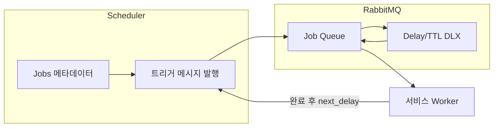

# Ultra Jennie - Scheduler/Job Flow (RabbitMQ Delay 패턴, Mermaid)

```mermaid
flowchart LR
  subgraph Scheduler
    Jobs[Jobs 메타데이터]
    Publish[트리거 메시지 발행]
  end
  subgraph MQ[RabbitMQ]
    Queue[Job Queue]
    DLX[Delay/TTL DLX]
  end
  Worker[서비스 Worker] -->|완료 후 next_delay| Publish
  Publish --> Queue
  Queue --> Worker
  Queue --> DLX --> Queue
  Jobs --> Publish
```

