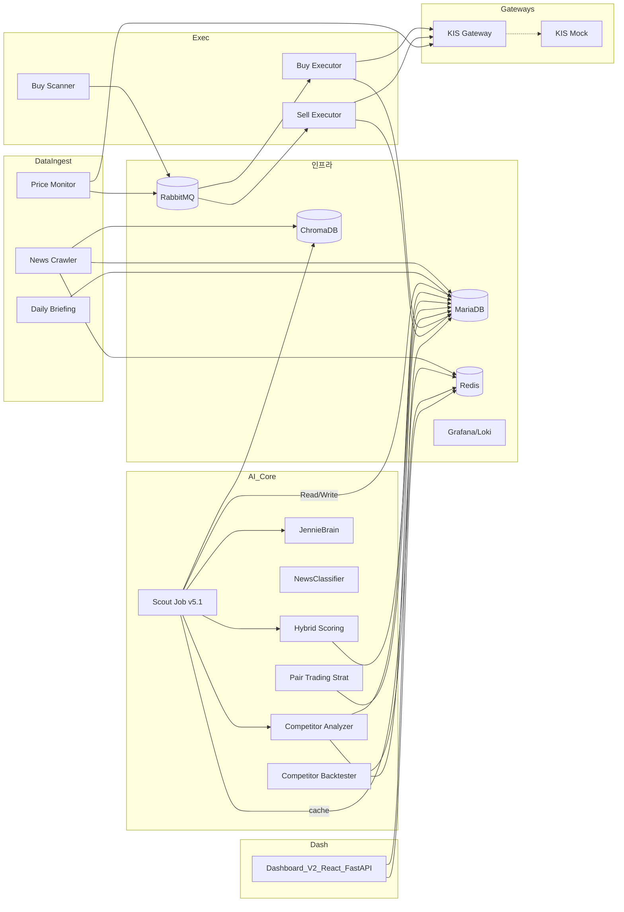
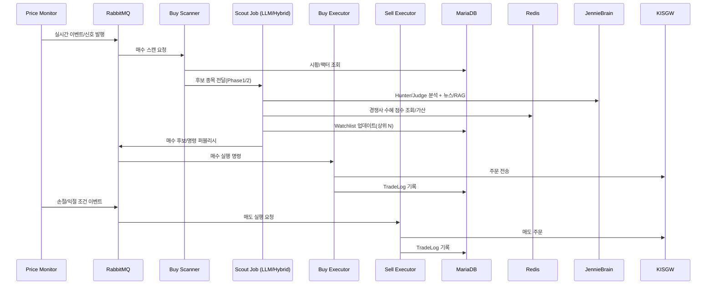
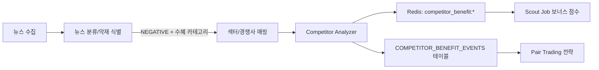
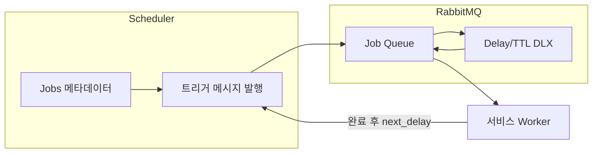

# Ultra Jennie Architecture Diagrams (Mermaid)

## 1. 전체 아키텍처


## 2. 매수/매도 의사결정 흐름


## 3. MSA 주요 모듈 연계
```mermaid
flowchart TB
  NewsCrawler --> ChromaDB
  NewsCrawler --> Redis
  NewsCrawler --> RDB[(MariaDB)]

  ScoutJob --> ChromaDB
  ScoutJob --> Redis
  ScoutJob --> RDB
  ScoutJob --> MQ[(RabbitMQ)]

  BuyScanner --> RDB
  BuyScanner --> MQ

  PriceMonitor --> MQ
  DailyBriefing --> RDB

  MQ --> BuyExecutor
  MQ --> SellExecutor

  BuyExecutor --> KISGateway
  SellExecutor --> KISGateway
  KISGateway -->|실거래| KIS API

  DashboardV1 --> RDB
  DashboardV1 --> Redis
  DashboardV2 --> RDB
  DashboardV2 --> Redis

  subgraph Scoring/AI
    HybridScoring
    CompetitorAnalyzer
    PairTrading
    Backtester
    NewsClassifier
    JennieBrain
  end

  ScoutJob --- HybridScoring
  ScoutJob --- CompetitorAnalyzer
  ScoutJob --- NewsClassifier
  NewsCrawler --- NewsClassifier
  ScoutJob --- JennieBrain
  CompetitorAnalyzer --- Redis
  PairTrading --- RDB
  Backtester --- RDB
```

## 4. Competitor Benefit Flow


## 5. LLM Decision Chain (Hunter/Judge)
```mermaid
flowchart LR
  Quant[Quant Score\n(팩터/시장)] --> Hunter[Hunter (Claude)]
  NewsCtx[RAG 뉴스 컨텍스트] --> Hunter
  CompBenefit[경쟁사 수혜 점수] --> Hunter
  Hunter --> Debate[Debate (Bull vs Bear)]
  Debate --> Judge[Judge (OpenAI)]
  Judge --> Decision[최종 승인/거부 + 수량]
  Decision --> Watchlist[Watchlist 업데이트]
```

## 6. Scheduler/Job Flow (RabbitMQ Delay 패턴)


